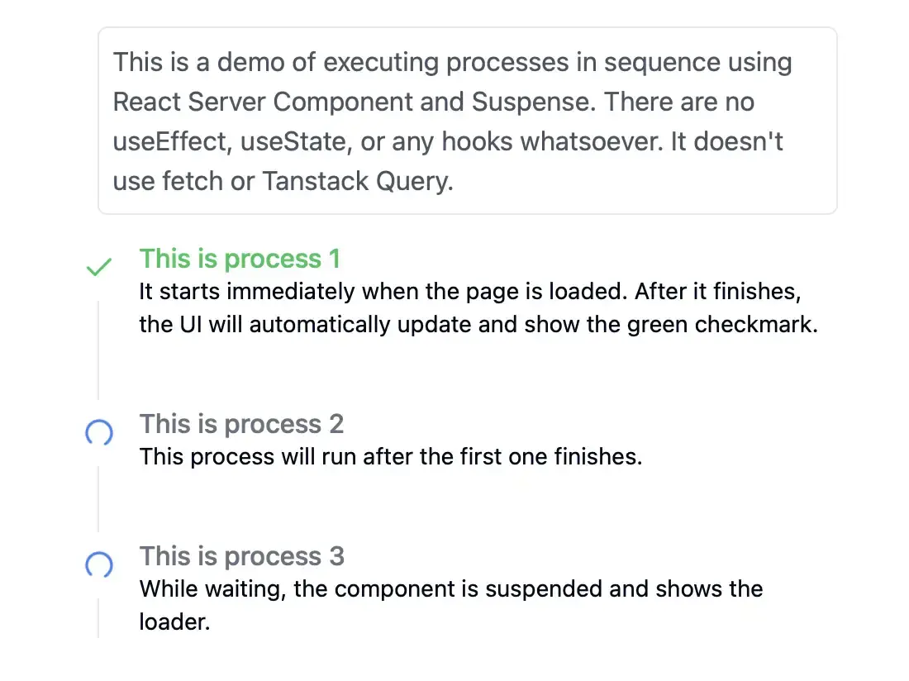

Imagine you allow a user to make a purchase of a service or product. If you use one of the popular payment gateways, you can easily show the payment page provided by the payment gateway. Once the user completes the payment, the payment gateway usually does two things:

1. Redirects the user to a confirmation or success page that you own.
2. At the same time, it notifies your server that the payment is completed via a webhook.

Now say you want to show the steps that are performed on the confirmation or success page:

1. Confirm that the payment is completed successfully. Sometimes your server might not have received the webhook from the provider yet by the time the user reaches the confirmation page. So the user needs to stay on this first step until the webhook is received and the payment is confirmed.
2. Once the payment is confirmed, let's imagine that you need to call another third-party API to create a resource. For example, you might use a third-party API to create a personalized PDF file for the user.
3. After the PDF is created, you need to upload it to a cloud storage service like AWS S3.
4. Finally, you need to send an email to the user with the PDF file.

All of these steps won't happen instantly. So you want to show the user which step is currently being performed to keep the user informed. Something similar to this:

## The solution

There are several ways to achieve this. One way is to use services like [Inngest](https://www.inngest.com/) and [Trigger.dev](https://trigger.dev). Once you set up the tasks in one of those services, you can trigger the functions and then [check the status of the tasks](https://www.inngest.com/docs/examples/fetch-run-status-and-output#fetching-triggered-function-status-and-output) by calling the endpoints provided by the services.

Or you can simply create multiple route handlers and call them one after another from the client side. But for every endpoint call, you need to manually maintain the state of the progress and keep the UI in sync using `useState` or `useEffect`.

Both of these approaches are very doable, but they have a few drawbacks: they are tedious to code and maintain.

## RSC and Suspense: The new way

If you haven't read, I wrote about a [new way to fetch data in the era of React Server Components and Suspense](https://www.nico.fyi/blog/simplify-data-fetching-with-rsc-suspense-and-use-api-in-next-js). Using the technique described in the article, we can easily implement the confirmation page above.
